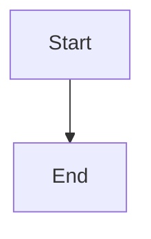

# Content Creation Guide

How to create and organize content for the blog.

## Content Types & Directory Structure

```
/content/
├── article/          # Published blog articles
├── developer/        # Published technical guides (tagged)
├── _backlog/         # Draft content (dev-only, hidden in production)
├── list/             # Curated link lists (JSON format)
├── tags.json         # Tag definitions for developer content
└── lists.json        # Section metadata for list pages
```

**Important conventions:**
- Underscore prefix (`_backlog`) hides directories from production menu
- Only `article` and `developer` content is included in RSS feeds
- List content is JSON-based, everything else is Markdown

## Markdown Content Structure

All markdown files require YAML frontmatter:

```yaml
---
title: "Your Title Here"           # Required (fallback: filename)
date: "YYYY-MM-DD"                 # Required for sorting (fallback: 2020-01-01)
description: "Brief description"   # Optional (fallback: filename)
tag: "elixir"                      # Required for developer/ content only
---

Your markdown content here...
```

**Critical rules:**
- Files must be directly in the content type directory (flat structure, no subdirectories)
- Filename format: `001-slug-name.md` → becomes `/type/001-slug-name`
- Content is always sorted reverse-chronologically by date
- For `developer/` content, the tag must match exactly what's in `tags.json`

## Markdown Features

### Supported Syntax

- **GitHub Flavored Markdown** (via `remark-gfm`)
  - Tables
  - Strikethrough
  - Task lists
  - Autolinks

- **Syntax Highlighting** (via `rehype-prism`)
  - Automatic language detection
  - Supports all major languages

- **Mermaid Diagrams**
  - Flowcharts, sequence diagrams, class diagrams, etc.
  - Automatically styled for light/dark mode

### Example Markdown

````markdown
---
title: "My Article"
date: "2026-01-31"
description: "An example article"
---

## Introduction

This is a paragraph with **bold** and *italic* text.

### Code Block

```javascript
function hello() {
  console.log('Hello, world!')
}
```

### Mermaid Diagram



### Table

| Column 1 | Column 2 |
|----------|----------|
| Data 1   | Data 2   |
````

## Adding New Content

### Create a New Article

1. Create `content/article/XXX-title.md` with frontmatter
2. Article appears at `/article/XXX-title`

**Example:**
```bash
# Create the file
touch content/article/003-my-new-article.md
```

```yaml
---
title: "My New Article"
date: "2026-01-31"
description: "A brief description of my article"
---

Your content here...
```

### Create a New Developer Guide

1. Add tag to `content/tags.json` if it doesn't exist
2. Create `content/developer/XXX-title.md` with frontmatter including `tag: "yourtag"`
3. Guide appears at `/developer/yourtag/XXX-title`

**Example:**
```bash
# Create the file
touch content/developer/005-elixir-tips.md
```

```yaml
---
title: "Elixir Tips and Tricks"
date: "2026-01-31"
description: "Useful Elixir patterns"
tag: "elixir"
---

Your content here...
```

### Create a New List

1. Add metadata to `content/lists.json`
2. Create `content/list/yourlist.json` with structure
3. List appears at `/list/yourlist`

**Example:**

Edit `content/lists.json`:
```json
[
  {
    "title": "My Favorite Tools",
    "description": "Tools I use daily",
    "tag": "tools"
  }
]
```

Create `content/list/tools.json`:
```json
{
  "links": [
    {
      "title": "VS Code",
      "description": "Code editor",
      "href": "https://code.visualstudio.com"
    }
  ]
}
```

### Draft Content

- Place in `content/_backlog/` - visible in dev mode only
- Move to published directory when ready

**Example:**
```bash
# Create draft
touch content/_backlog/draft-article.md

# When ready to publish
mv content/_backlog/draft-article.md content/article/004-published-article.md
```

## Adding New Tags

To add a new tag for developer content:

1. Edit `content/tags.json`:
```json
{
  "tags": [
    {
      "title": "Display Name",
      "tag": "slug-name"
    }
  ]
}
```

2. Use in content frontmatter:
```yaml
tag: "slug-name"
```

The tag creates automatic filtering at `/developer/slug-name`

## Content Organization Tips

- **Use descriptive filenames** - They become URLs
- **Date accurately** - Controls sort order
- **Write good descriptions** - Used in meta tags and RSS
- **Tag consistently** - Use existing tags when possible
- **Draft in _backlog** - Keep unpublished work organized
