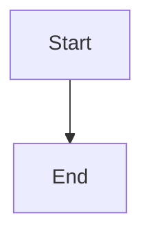

# Development Guide

Technical documentation for developing and maintaining the Next.js blog.

## Development Commands

```bash
# Install dependencies
npm install

# Run development server (http://localhost:3000)
npm run dev

# Build for production (outputs to out/ directory)
npm run build

# Run production build locally
npm start

# Lint code
npm run lint

# Format code (Prettier with Tailwind plugin)
npx prettier --write .
```

## Static Export Configuration

The site uses `output: "export"` in `next.config.mjs`, which means:
- All pages must use `getStaticProps` and `getStaticPaths`
- No server-side rendering or API routes
- Images are unoptimized (`images: { unoptimized: true }`)
- Output goes to `out/` directory
- Must explicitly define all dynamic paths (`fallback: false`)

## Routing Architecture

### Three-Level Hierarchy (Developer Content Only)

```
/developer                    # All developer content with tag sidebar
/developer/elixir            # Filtered by tag with tag sidebar
/developer/elixir/001-...    # Individual article
```

This is the ONLY content type with 3-level routing. The tag is part of the URL path.

### Two-Level Hierarchy (Articles, Lists, Backlog)

```
/article                     # All articles
/article/001-...            # Individual article

/list                       # First list (redirects to first tag)
/list/podcast              # Individual list

/backlog                    # All backlog items (dev-only)
/backlog/001-...           # Individual backlog item
```

### Important URL Patterns

```javascript
// Article links
href={`/article/${slug}`}

// Developer links (includes tag!)
href={`/developer/${tag}/${slug}`}

// List links
href={`/list/${tag}`}
```

## Content Loading System

Located in `/src/lib/getContent.js`:

```javascript
getContent(type, slug)   // Load single content item with frontmatter + body
getContents(type)        // Load all content of a type (metadata only)
getAllContents()         // Load article + developer only (for RSS)
```

**Defaults when frontmatter is missing:**
- `title`: filename without extension
- `date`: '2020-01-01'
- `description`: filename
- `tag`: 'general'

## Markdown Rendering Stack

```javascript
import ReactMarkdown from 'react-markdown'
import remarkGfm from 'remark-gfm'              // Tables, strikethrough
import rehypePrism from '@mapbox/rehype-prism'  // Syntax highlighting
```

All markdown is rendered through `ReactMarkdown` with these plugins.

### Mermaid Diagrams

Mermaid diagrams are supported in code blocks:

````markdown

````

The `CodeBlock` component detects `language-mermaid` and routes to `MermaidDiagram` component, which:
- Dynamically imports Mermaid library
- Renders diagrams client-side
- Automatically updates when dark mode toggles
- Shows errors for invalid syntax

## Path Aliases

The project uses `@/` as an alias for `src/`:

```javascript
import { getContent } from '@/lib/getContent'
import Header from '@/components/Header'
```

Configured in `jsconfig.json`.

## Common Patterns

### Dynamic Page with Tag Filtering

See `/src/pages/developer/[tag]/index.jsx`:

```javascript
export async function getStaticPaths() {
  const { tags } = await import('content/tags.json')
  return {
    paths: tags.map(t => ({ params: { tag: t.tag } })),
    fallback: false
  }
}

export async function getStaticProps({ params }) {
  const contents = await getContents('developer')
  const filtered = contents.filter(c => c.tag == params.tag)
  return { props: { contents: filtered, tag: params.tag } }
}
```

### Dynamic JSON Import

See `/src/pages/list/[tag]/index.jsx`:

```javascript
export async function getStaticProps({ params }) {
  const { links } = await import(`content/list/${params.tag}.json`)
  return { props: { links } }
}
```

This requires the JSON file to exist at build time.

### Menu Construction

Menu items come from `/src/lib/getMenu.js`. The backlog section only appears in dev:

```javascript
if (process.env.NODE_ENV !== 'production') {
  menu.push({ name: 'Backlog', href: '/backlog' })
}
```

## Build Output & Deployment

```bash
npm run build
# Generates static HTML/CSS/JS to out/ directory
# Deploy out/ folder to any static host (GitHub Pages, Vercel, S3, etc.)
```

The site is completely static - no server or database required.

### GitHub Pages Deployment

The repository includes a GitHub Actions workflow (`.github/workflows/nextjs.yml`) that automatically deploys to GitHub Pages on push to `main`.

**Environment Variables:**
The workflow uses the following environment variables:
- `NEXT_PUBLIC_SITE_URL`: Production site URL (set as GitHub secret or default in workflow)
- `GENERATE_RSS`: Enable/disable RSS feed generation (set as GitHub secret, defaults to `true`)

**Setup:**
1. Enable GitHub Pages in repository settings
2. Set deployment source to "GitHub Actions"
3. (Optional) Add secrets in Settings → Secrets and variables → Actions:
   - `NEXT_PUBLIC_SITE_URL`: Your production URL
   - `GENERATE_RSS`: `true` or `false`

## RSS Feed Generation

RSS feeds are generated at build time via `/src/lib/generateRssFeed.js`:
- Triggered on homepage build (`/src/pages/index.jsx`)
- Only includes `article` and `developer` content types
- Outputs `/public/rss/feed.xml` and `/public/rss/feed.json`
- Production builds only
- **Controlled by environment variable**: Set `GENERATE_RSS=true` in `.env.local` to enable

**To enable RSS generation:**
```bash
# In .env.local
GENERATE_RSS=true
```

**To disable RSS generation (default):**
```bash
# In .env.local
GENERATE_RSS=false
```

## Color Customization

The site uses a custom teal color scheme defined in `tailwind.config.js`:

```javascript
theme: {
  extend: {
    colors: {
      teal: {
        500: '#0d9488', // Darker teal for light mode
        600: '#0f766e', // Even darker for hover states
      },
    },
  },
}
```

Light mode uses darker teal (`teal-500`/`teal-600`) for better contrast.
Dark mode uses lighter teal (`teal-400`) which is the default Tailwind value.
