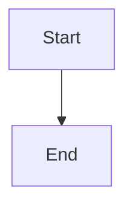

# Content Creation Guide

Use these guidelines when creating and organizing content for the blog.

## Content Types & Directory Structure

```
/content/
├── article/          # Published blog articles
├── developer/        # Published technical guides (tagged)
├── _backlog/         # Draft content (dev-only, hidden in production)
├── list/             # Curated link lists (JSON format)
├── tags.json         # Tag definitions for developer content
└── lists.json        # Section metadata for list pages
```

**Important conventions:**

- Underscore prefix (`_backlog`) hides directories from production menu
- Only `article` and `developer` content is included in RSS feeds
- List content is JSON-based, everything else is Markdown

## Markdown Content Structure

All markdown files require YAML frontmatter:

```yaml
---
title: 'Your Title Here' # Required (fallback: filename)
date: 'YYYY-MM-DD' # Required for sorting (fallback: 2020-01-01)
description: 'Brief description' # Optional (fallback: filename)
tag: 'elixir' # Required for developer/ content only
---
# Your Heading Here

Your markdown content here...
```

**Critical rules:**

- Files must be directly in the content type directory (flat structure, no subdirectories)
- Filename format: `YYYY-MM-DD-slug-name.md` → becomes `/type/YYYY-MM-DD-slug-name`
- Use the frontmatter date for the filename date prefix
- Content is always sorted reverse-chronologically by date
- For `developer/` content, the tag must match exactly what's in `tags.json`
- **Never add trailing periods** in frontmatter fields (title, description, heading, etc.)

## Process for Creating New Content

### Create a New Article

1. Create `content/article/YYYY-MM-DD-title.md` with frontmatter (use today's date)
2. Article appears at `/article/YYYY-MM-DD-title`

### Create a New Developer Guide

1. **Add tag to `content/tags.json` if it doesn't exist**
2. Create `content/developer/YYYY-MM-DD-title.md` with frontmatter including `tag: "yourtag"`
3. Guide appears at `/developer/yourtag/YYYY-MM-DD-title`

### Create a New List

1. Add metadata to `content/lists.json`:

   ```json
   [
     {
       "title": "My Favorite Tools",
       "description": "Tools I use daily",
       "tag": "tools"
     }
   ]
   ```

2. Create `content/list/tools.json`:
   ```json
   {
     "links": [
       {
         "title": "VS Code",
         "description": "Code editor",
         "href": "https://code.visualstudio.com"
       }
     ]
   }
   ```

### Draft Content in Backlog

1. Place in `content/_backlog/` - visible in dev mode only
2. Use date-based naming: `YYYY-MM-DD-slug.md`
3. When publishing, move to the target directory:
   ```bash
   mv content/_backlog/2026-04-02-draft.md content/article/2026-04-02-draft.md
   ```

## Markdown Features

**Supported syntax:**

- GitHub Flavored Markdown (tables, strikethrough, task lists, autolinks)
- Syntax highlighting (automatic language detection)
- Mermaid diagrams (flowcharts, sequence diagrams, etc.)
- Infographic components (stat-block, timeline, comparison-table, progress-bar)

**Example:**

````markdown
---
title: 'My Article'
date: '2026-02-14'
description: 'An example article'
---

## Introduction

This is a paragraph with **bold** and _italic_ text.

### Code Block

```javascript
function hello() {
  console.log('Hello, world!')
}
```

### Mermaid Diagram



### Table

| Column 1 | Column 2 |
| -------- | -------- |
| Data 1   | Data 2   |
````

## Infographic Components

Four infographic components are available for creating data visualizations in articles.

### 1. StatBlock - Key Metrics

Display statistics with optional trend indicators and icons.

**JSON Schema:**

```json
{
  "title": "Metric Name", // Required: Display label
  "value": "123", // Required: The main value
  "change": "+12%", // Optional: Change indicator
  "trend": "up|down|neutral", // Optional: Trend direction
  "description": "vs last week", // Optional: Additional context
  "icon": "icon-name" // Optional: Icon identifier
}
```

**Available Icons:**

- `dollar-sign` - Financial metrics
- `users` - User/customer counts
- `activity` - General activity
- `target` - Goals/targets
- `zap` - Performance metrics

**Example - Single Stat:**

````markdown
```stat-block
{
  "title": "Monthly Active Users",
  "value": "12,458",
  "change": "+23.1%",
  "trend": "up",
  "description": "vs last month",
  "icon": "users"
}
```
````

**Example - Multiple Stats (Grid Layout):**

````markdown
```stat-block
[
  {
    "title": "Revenue",
    "value": "$42,500",
    "change": "+12.3%",
    "trend": "up",
    "icon": "dollar-sign"
  },
  {
    "title": "Active Projects",
    "value": "87",
    "change": "+5",
    "trend": "up",
    "icon": "activity"
  }
]
```
````

**Layout:** Responsive grid - 1 column (mobile) → 2 (tablet) → 3 (desktop) → 4 (wide)

### 2. Timeline - Project Milestones

Display events in chronological order with status indicators.

**JSON Schema:**

```json
{
  "items": [
    // Required: Array of timeline items
    {
      "title": "Event Name", // Required: Event title
      "date": "January 2026", // Optional: Date label
      "description": "Details", // Optional: Event description
      "status": "completed|current|upcoming" // Optional: Status
    }
  ]
}
```

**Status Types:**

- `completed` - Green checkmark, solid connecting line
- `current` - Teal circle, draws attention to current item
- `upcoming` - Gray clock icon, future event

**Example:**

````markdown
```timeline
{
  "items": [
    {
      "title": "Project Kickoff",
      "date": "January 2026",
      "description": "Initial planning completed",
      "status": "completed"
    },
    {
      "title": "Beta Testing",
      "date": "February 2026",
      "description": "Open beta with users",
      "status": "current"
    },
    {
      "title": "Public Launch",
      "date": "March 2026",
      "description": "Full release",
      "status": "upcoming"
    }
  ]
}
```
````

### 3. ComparisonTable - Feature Comparison

Display feature comparisons across multiple options.

**JSON Schema:**

```json
{
  "title": "Comparison Title", // Optional: Table heading
  "headers": ["Feature", "A", "B"], // Required: Column headers
  "rows": [
    // Required: Array of rows
    {
      "feature": "Feature Name", // Required: Row label
      "values": ["text", true, 10] // Required: Values per column
    }
  ]
}
```

**Value Types:**

- `string` or `number` - Displayed as text
- `true` - Green checkmark icon
- `false` - Red X icon

**Example:**

````markdown
```comparison-table
{
  "title": "Pricing Plans",
  "headers": ["Feature", "Basic", "Pro", "Enterprise"],
  "rows": [
    {
      "feature": "Monthly Users",
      "values": ["100", "1,000", "Unlimited"]
    },
    {
      "feature": "API Access",
      "values": [false, true, true]
    },
    {
      "feature": "Support",
      "values": ["Email", "Priority", "24/7 Phone"]
    }
  ]
}
```
````

**Layout:** Responsive table with horizontal scroll on mobile

### 4. ProgressBar - Percentage Progress

Display progress indicators with optional labels and colors.

**JSON Schema:**

```json
{
  "title": "Progress Label", // Optional: Display above bar
  "progress": 67, // Required: 0-100 (clamped)
  "label": "Additional info", // Optional: Display below bar
  "color": "blue|green|teal|red|yellow", // Optional: Bar color
  "showPercentage": true // Optional: Show % on right
}
```

**Colors:**

- `blue` - Default, general progress
- `green` - Success, completion
- `teal` - Secondary highlights
- `red` - Warnings, issues
- `yellow` - In progress, caution

**Example - Single Bar:**

````markdown
```progress-bar
{
  "title": "Project Completion",
  "progress": 67,
  "label": "On track for April delivery",
  "color": "blue",
  "showPercentage": true
}
```
````

**Example - Multiple Bars:**

````markdown
```progress-bar
[
  {
    "title": "Frontend Development",
    "progress": 85,
    "color": "green",
    "showPercentage": true
  },
  {
    "title": "Documentation",
    "progress": 45,
    "color": "yellow",
    "showPercentage": true
  }
]
```
````

## Common Errors & Troubleshooting

### Invalid JSON

**Error:** `Invalid JSON: Unexpected token...`

**Solution:** Validate your JSON syntax. Common issues:

- Missing quotes around strings
- Trailing commas in arrays/objects
- Unclosed brackets/braces

Use a JSON validator or IDE with JSON support.

### Missing Required Fields

**Error:** `Timeline requires an "items" array`

**Solution:** Check the JSON schema for each component:

- `timeline` requires `items` array
- `comparison-table` requires `headers` and `rows` arrays
- `stat-block` and `progress-bar` require `value` and `progress` respectively

### Component Not Rendering

**Possible causes:**

1. Language identifier misspelled (must be exact: `stat-block`, `timeline`, etc.)
2. Code fence not using triple backticks
3. JSON data is empty or malformed

**Debug:** Check browser console for errors, ensure code block format is correct.

### Dark Mode Issues

All infographic components automatically support dark mode. If colors look wrong:

- Ensure you're using standard color options (`blue`, `green`, etc.)
- Check that custom text doesn't override dark mode classes
- Verify Tailwind's dark mode is enabled (should be automatic)

## Adding New Tags

Edit `content/tags.json`:

```json
{
  "tags": [
    {
      "title": "Display Name",
      "tag": "slug-name"
    }
  ]
}
```

Use in content frontmatter:

```yaml
tag: 'slug-name'
```

The tag creates automatic filtering at `/developer/slug-name`

## Content Organization Tips

- **Use descriptive filenames** - They become URLs
- **Date accurately** - Controls sort order
- **Write good descriptions** - Used in meta tags and RSS
- **Tag consistently** - Use existing tags when possible
- **Draft in \_backlog** - Keep unpublished work organized
