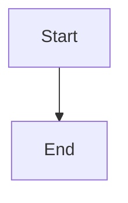

# Display Mermaid Diagrams

Add support for mermaid diagrams for content pages only

## Status: ✅ Implemented (2026-01-30)

## Implementation

### Package Dependencies
- Installed `mermaid` package for diagram rendering
- Bundle size impact: ~250KB (only loaded on pages with diagrams via code splitting)

### Components Created

**`src/components/MermaidDiagram.jsx`**
- Client-side diagram rendering using dynamic import
- Dark mode detection and automatic theme switching via MutationObserver
- Watches `<html>` class attribute for `dark` class changes
- Custom theme variables matching site design (teal-400/500, zinc palette)
- Error handling with user-friendly messages for invalid syntax
- Responsive container with rounded corners

**`src/components/CodeBlock.jsx`**
- Routes code blocks based on language classifier
- Detects `language-mermaid` from className
- Passes mermaid code to MermaidDiagram component
- Falls back to default Prism highlighting for all other languages
- Non-breaking change - preserves existing syntax highlighting

### Pages Modified

Added `components={{ code: CodeBlock }}` prop to ReactMarkdown in:
- `src/pages/article/[slug]/index.jsx`
- `src/pages/developer/[tag]/[slug]/index.jsx`
- `src/pages/backlog/[slug]/index.jsx`

### Test Content

Created `content/_backlog/999-mermaid-test.md` with examples:
- Flowchart diagram
- Sequence diagram
- Class diagram
- Regular code block (verifies Prism still works)

## Usage

In any markdown file (article, developer, backlog):

````markdown

````

Diagrams automatically:
- Render with site color scheme
- Update when dark mode toggles
- Show errors for invalid syntax

## Technical Details

- Works with static export (`output: "export"`)
- Runtime dark mode switching (no rebuild required)
- Code splitting ensures mermaid only loads when diagrams present
- Compatible with existing rehype-prism syntax highlighting
- No server-side rendering needed

## Testing Verified

✅ Development server starts without errors
✅ Production build succeeds
✅ Test page generates at `/backlog/999-mermaid-test`
✅ Dark mode toggle updates diagrams automatically
✅ Regular code blocks maintain Prism highlighting