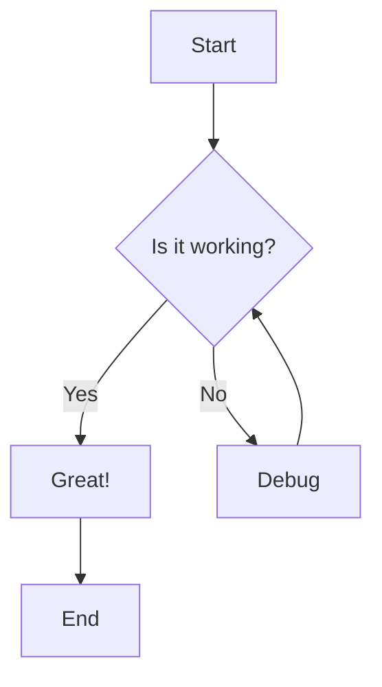
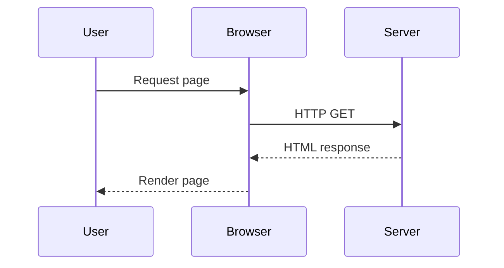
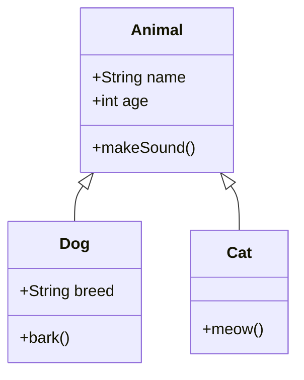

## Flowchart Example

This is a simple flowchart demonstrating conditional logic:



## Sequence Diagram

This shows interaction between user and browser:



## Class Diagram

Object-oriented structure example:



## Regular Code Block

This should still use Prism syntax highlighting:

```javascript
function hello() {
  console.log('Hello, world!')
}
```
